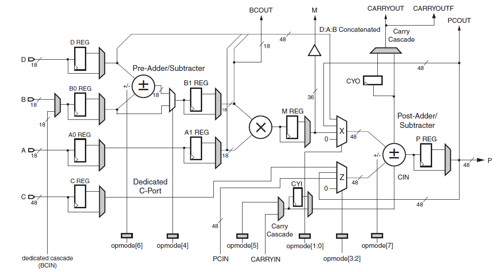

# By:
### Abanob Evram Shahata
### ECE Student @ Faculty of Engineering Fayoum University

# Spartan6-DSP48A1
## Project Overview
The Spartan-6 DSP48A1 slice is a powerful and flexible digital signal processing (DSP) component within the Xilinx Spartan-6 FPGA family. It is designed to handle high-performance arithmetic operations, making it ideal for a variety of DSP applications.

## DSP48A1_Block

## DSP48A1_schematic_diagram

## Features
**Arithmetic Operations**: The project demonstrates the use of the DSP48A1 slice for performing multiplication, addition, subtraction, and accumulation.
**Pipelining**: The design is optimized for high-speed operation by leveraging the pipelining capabilities of the DSP48A1 slice.
**Customizable Parameters**: Parameters such as bit-widths, operation modes, and pipeline depth can be easily modified to suit different application requirements
